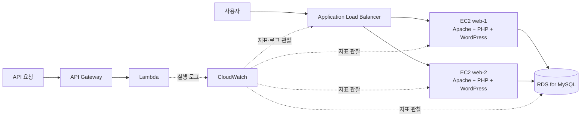

# WEEK8 — 로컬 서버 구조를 AWS 클라우드에 옮겨 보기

1~7주차에는 한 대의 노트북에서 애플리케이션 실행, Docker 컨테이너, PostgreSQL, Nginx, 로드밸런싱, Prometheus·Grafana, Kubernetes를 차례로 다뤘습니다.

8주차에는 같은 서버 운영 원리를 AWS에서 확인합니다. VPC 안에 웹 서버와 DB를 배치하고, Application Load Balancer가 두 EC2 인스턴스로 요청을 나누게 합니다. CloudWatch로 상태를 관찰한 뒤, 항상 켜 두는 서버 없이 요청 때만 실행되는 Lambda·API Gateway도 비교합니다.

> 이 구조 전체를 Kubernetes로 이전하는 실습은 아닙니다. 7주차에는 Kubernetes를 로컬에서 사용했고, 8주차에는 AWS의 기본 인프라 자원이 기존 구조의 어느 부분을 담당하는지 확인합니다.

## 문서

| 순서 | 문서 | 내용 |
| --- | --- | --- |
| 1 | [01-환경세팅.md](01-환경세팅.md) | 계정 보안, 리전, 비용, 로컬 도구 준비 |
| 2 | [02-이론.md](02-이론.md) | VPC·EC2·RDS·ALB·CloudWatch·Lambda의 역할 |
| 3 | [03-실습.md](03-실습.md) | AWS 네트워크와 2계층 웹 서비스 구성·관찰·복구 |
| 4 | [04-트러블슈팅.md](04-트러블슈팅.md) | SSH, RDS, ALB, CloudWatch, Lambda 오류 해결 |
| 5 | [records/_템플릿.md](records/_템플릿.md) | 자원 ID, 성공 증거, 삭제 결과 기록 |

## 이번 주차에 사용하는 AWS 서비스

| AWS 서비스 | 이번 실습에서 맡는 역할 | 앞선 주차와의 연결 |
| --- | --- | --- |
| VPC·Subnet·Route Table·Internet Gateway | 클라우드 내부 네트워크와 인터넷 경로 | Docker 네트워크와 포트 공개 |
| Security Group | 자원별 허용 포트와 접근 출처 제한 | Nginx만 공개하고 앱·DB를 보호한 구성 |
| EC2·AMI·EBS | 웹 서버 실행, 서버 복제, 디스크 보관 | Docker 이미지·컨테이너·볼륨 |
| RDS for MySQL | AWS가 운영 작업 일부를 관리하는 관계형 DB | PostgreSQL 컨테이너와 Named Volume |
| Application Load Balancer·Target Group | 두 웹 서버로 요청 분산, 상태 검사 | Nginx upstream과 장애 우회 |
| CloudWatch | AWS 자원의 지표·로그·알람 확인 | Prometheus·Grafana와 컨테이너 로그 |
| Lambda·API Gateway | 요청 때만 코드를 실행하는 HTTP API | 항상 실행 중인 PetClinic 서버와 비교 |

## 완료 기준

- ALB 주소로 접속하면 두 EC2 중 정상인 서버가 응답한다.
- RDS는 퍼블릭 액세스가 꺼져 있고 EC2의 Security Group에서만 `3306` 접근을 허용한다.
- 웹 서버 한 대의 Apache를 중지하면 Target Group에서 해당 서버가 `Unhealthy`가 되고 나머지 서버가 계속 응답한다.
- CloudWatch에서 ALB 요청 수·정상 대상 수와 RDS 연결 수를 확인한다.
- API Gateway 주소가 Lambda를 호출해 `200` JSON 응답을 반환하고 CloudWatch Logs에 실행 기록을 남긴다.
- 실습 종료 후 ALB, EC2, RDS, Lambda, API Gateway와 관련 저장 자원을 삭제했음을 확인한다.

## 비용 주의

RDS와 Application Load Balancer는 실행 시간에 따라 비용이 발생할 수 있습니다. 무료 사용 범위는 계정과 시점에 따라 다르므로 콘솔에 표시되는 예상 비용과 [AWS 요금 페이지](https://aws.amazon.com/pricing/)를 확인합니다. 실습이 끝나면 [03-실습.md의 정리 단계](03-실습.md#11-유료-자원-정리)를 반드시 수행합니다.

## 공식 참고 자료

- [VPC의 웹 서버·DB 서버 구성 예시](https://docs.aws.amazon.com/vpc/latest/userguide/vpc-example-web-database-servers.html)
- [Amazon Linux 2023에 WordPress 설치](https://docs.aws.amazon.com/linux/al2023/ug/hosting-wordpress-aml-2023.html)
- [RDS DB 인스턴스 생성](https://docs.aws.amazon.com/AmazonRDS/latest/UserGuide/USER_CreateDBInstance.html)
- [Application Load Balancer 생성](https://docs.aws.amazon.com/elasticloadbalancing/latest/application/create-application-load-balancer.html)
- [ALB Target Group 상태 검사](https://docs.aws.amazon.com/elasticloadbalancing/latest/application/target-group-health-checks.html)
- [CloudWatch 알람](https://docs.aws.amazon.com/AmazonCloudWatch/latest/monitoring/CloudWatch_Alarms.html)
- [API Gateway HTTP API 시작하기](https://docs.aws.amazon.com/apigateway/latest/developerguide/getting-started.html)

